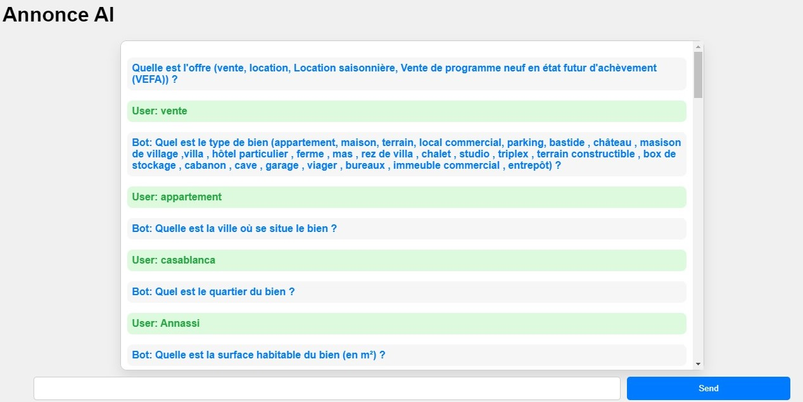

# AI Real Estate Chatbot

This is an AI chatbot built using OpenAI's GPT-4 model. The chatbot assists in generating real estate property listings by guiding users through a series of questions to understand the type of property, the sale/rent price, location, and other important features. The bot then generates a detailed, engaging description of the property in French.

## Features
- Interactive chatbot.
- Uses AJAX for form submission and to update the chatbox without page refresh.
- Uses Flask, a lightweight Python web framework.
- Integrates OpenAI's GPT-4 model for generating property descriptions.

## Project Structure
The project has a simple structure:
- `app.py` is the main Python script that handles the web server and the chatbot logic.
- `index.html` is the main webpage. It includes a simple chatbox and a form for user input.
- `questions.py` contains a Python dictionary with the chatbot states and questions.

## Installation

### Requirements
- Python 3.6 or above
- Flask web framework
- OpenAI Python client
- `fuzzywuzzy` for fuzzy string matching


To install the required packages, run:
```bash
pip install -r requirements.txt

In the following screenshot, you can see the user interface of our application in action:



As can be seen from the image, the user types their message in the input box, then presses the 'Send' button. The chatbot responds and the conversation is displayed in the chatbox.

